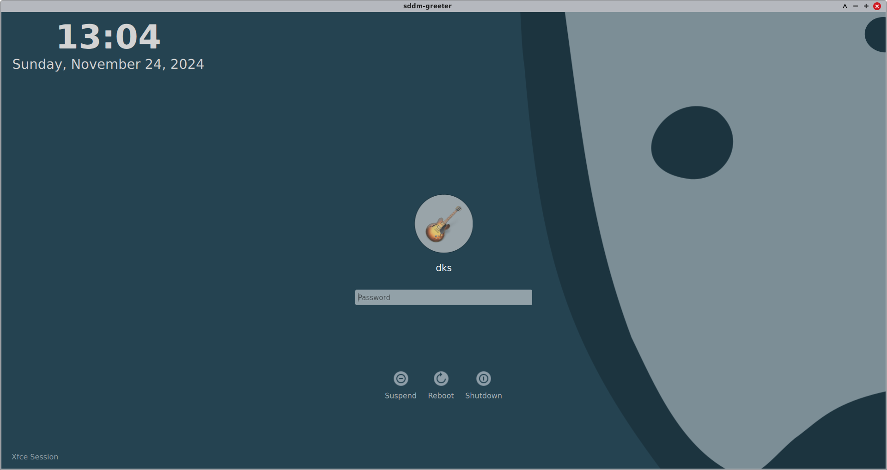

# dks-sddm-theme

This SDDM theme is a slightly modified version of 'Chili login theme for SDDM' created by Marian Arlt.
[[https://github.com/MarianArlt/sddm-chili]]

After installing, change the theme name to "chili-dks" in /etc/sddm.conf as shown below.

#+begin_example
[Theme]
# Current theme name
Current=chili-dks
#+end_example

* Requirements

This theme targets Qt 6 (SDDM 0.21 or newer built with Qt 6).

- sddm (Qt 6 build)
- Qt Quick Controls (qtdeclarative)
- qt5compat (=Qt5Compat.GraphicalEffects=)
- qtvirtualkeyboard (optional; the theme loads fine with or without it)

The Qt 5 version of this theme is available in the git history.

* Tests

#+begin_example
tests/run.sh                     # greeter smoke test + component tests (offscreen)
QT_QPA_PLATFORM=xcb tests/run.sh # also runs the rendering checks (needs an X display)
#+end_example
